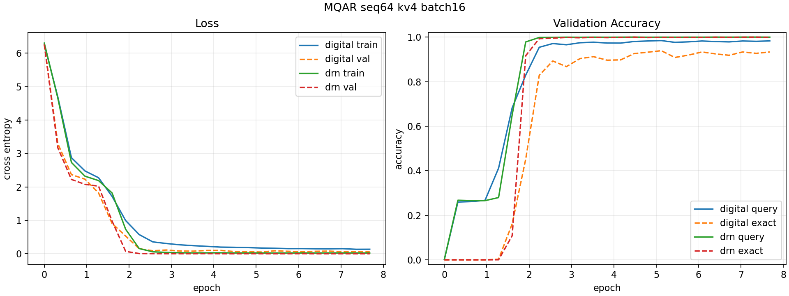

# MQAR Digital vs DRN, Batch 16

This case compares a fully digital GPT-style transformer against `SmallDRNGPT`
on the same small-gpt-compatible MQAR task.

Task:

- `seq_len: 64`
- `num_kv_pairs: 4`
- `vocab_size: 512`
- `train_examples: 50000`
- `val_examples: 5000`
- `batch_size: 16`
- `max_steps: 24000`
- normalized epoch: `step * batch_size / train_examples`

Shared transformer settings:

- `d_model: 128`
- `n_heads: 4`
- `n_layers: 2`
- `mlp_ratio: 4`
- `dropout: 0.1`
- `lr: 3e-4`
- AdamW betas `(0.9, 0.95)`
- `weight_decay: 0.1`, excluding embeddings/biases/1D parameters

DRN settings:

- `drn_non_linearity: perfect_diode`
- `drn_mode: asynchronous`
- `drn_signed_drive: true`
- `train_num_iterations: 6`
- `eval_num_iterations: 6`

## Commands

Digital:

```bash
cd /home/filip/digital_drn
/home/filip/miniconda3/envs/py312/bin/python -m digital_drn.app.mqar_digital_benchmark_cli \
  --device cuda \
  --seq_len 64 \
  --num_kv_pairs 4 \
  --train_examples 50000 \
  --val_examples 5000 \
  --batch_size 16 \
  --max_steps 24000 \
  --eval_every 1000 \
  --lr 3.0e-4 \
  --out_dir simulation_results/mqar_digital_seq64_kv4_bs16_nodecay_lr3e4
```

DRN:

```bash
cd /home/filip/digital_drn
/home/filip/miniconda3/envs/py312/bin/python -m digital_drn.app.mqar_benchmark_cli \
  --device cuda \
  --seq_len 64 \
  --num_kv_pairs 4 \
  --train_examples 50000 \
  --val_examples 5000 \
  --batch_size 16 \
  --max_steps 24000 \
  --eval_every 1000 \
  --lr 3.0e-4 \
  --drn_num_iterations 6 \
  --train_num_iterations 6 \
  --eval_num_iterations 6 \
  --out_dir simulation_results/mqar_drn_seq64_kv4_bs16_lr3e4_iter6
```

Plot:

```bash
/home/filip/miniconda3/envs/py312/bin/python -m digital_drn.app.plot_mqar_benchmark_cli \
  --history digital simulation_results/mqar_digital_seq64_kv4_bs16_nodecay_lr3e4/20260422-161841-nom-cool-2/history.json \
  --history drn simulation_results/mqar_drn_seq64_kv4_bs16_lr3e4_iter6/20260422-162011-nom-cool-2/history.json \
  --out-dir cases/transformer_cases/mqar_digital_vs_drn_bs16_seq64_kv4 \
  --title "MQAR seq64 kv4 batch16"
```

## Results

Run directories:

- digital: `/home/filip/digital_drn/simulation_results/mqar_digital_seq64_kv4_bs16_nodecay_lr3e4/20260422-161841-nom-cool-2`
- DRN: `/home/filip/digital_drn/simulation_results/mqar_drn_seq64_kv4_bs16_lr3e4_iter6/20260422-162011-nom-cool-2`

| model | best step | best epoch | best val loss | best val query acc | best val exact acc | final val query acc |
| --- | ---: | ---: | ---: | ---: | ---: | ---: |
| digital | 16000 | 5.12 | 0.0526 | 0.9843 | 0.9388 | 0.9828 |
| DRN | 14000 | 4.48 | 0.0005 | 0.9999 | 0.9996 | 0.9997 |

Plot:



## Notes

An initial `seq_len=128`, `num_kv_pairs=8`, `batch_size=16`, `max_steps=5000`
probe covered only `0.8` epoch and did not solve the task, so it was not used
as the comparison benchmark. The selected `64/4` task gives a reliable digital
baseline and the DRN run reproduces it with six equilibrium iterations.
