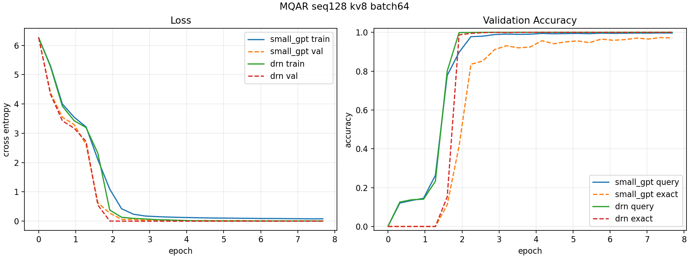

# MQAR Digital vs DRN, Sequence Length 128

This case repeats the digital-vs-DRN MQAR comparison on the larger
small-gpt-compatible task.

Task:

- `seq_len: 128`
- `num_kv_pairs: 8`
- `vocab_size: 512`
- `train_examples: 100000`
- `val_examples: 5000`
- `batch_size: 64`
- `max_steps: 12000`
- normalized epoch: `step * batch_size / train_examples`

Shared transformer settings:

- `d_model: 128`
- `n_heads: 4`
- `n_layers: 2`
- `mlp_ratio: 4`
- `dropout: 0.1`
- `lr: 3e-4`
- AdamW betas `(0.9, 0.95)`
- `weight_decay: 0.1`, excluding embeddings/biases/1D parameters

DRN settings:

- `drn_non_linearity: perfect_diode`
- `drn_mode: asynchronous`
- `drn_signed_drive: true`
- `train_num_iterations: 6`
- `eval_num_iterations: 6`

## Commands

Digital baseline from `/home/filip/small_gpt`:

```bash
cd /home/filip/small_gpt
/home/filip/miniconda3/envs/py312/bin/python train.py \
  --vocab_size 512 \
  --seq_len 128 \
  --num_kv_pairs 8 \
  --train_examples 100000 \
  --val_examples 5000 \
  --batch_size 64 \
  --lr 3.0e-4 \
  --max_steps 12000 \
  --eval_every 500 \
  --device cuda \
  --out_dir /home/filip/digital_drn/simulation_results/mqar_small_gpt_seq128_kv8_bs64_ref
```

DRN:

```bash
cd /home/filip/digital_drn
/home/filip/miniconda3/envs/py312/bin/python -m digital_drn.app.mqar_benchmark_cli \
  --device cuda \
  --seq_len 128 \
  --num_kv_pairs 8 \
  --train_examples 100000 \
  --val_examples 5000 \
  --batch_size 64 \
  --max_steps 12000 \
  --eval_every 500 \
  --lr 3.0e-4 \
  --drn_num_iterations 6 \
  --train_num_iterations 6 \
  --eval_num_iterations 6 \
  --out_dir simulation_results/mqar_drn_seq128_kv8_bs64_lr3e4_iter6
```

Plot:

```bash
/home/filip/miniconda3/envs/py312/bin/python -m digital_drn.app.plot_mqar_benchmark_cli \
  --history small_gpt simulation_results/mqar_small_gpt_seq128_kv8_bs64_ref/history.json \
  --history drn simulation_results/mqar_drn_seq128_kv8_bs64_lr3e4_iter6/20260422-163226-nom-cool-2/history.json \
  --out-dir cases/transformer_cases/mqar_digital_vs_drn_bs64_seq128_kv8 \
  --title "MQAR seq128 kv8 batch64"
```

## Results

Run directories:

- digital: `/home/filip/digital_drn/simulation_results/mqar_small_gpt_seq128_kv8_bs64_ref`
- DRN: `/home/filip/digital_drn/simulation_results/mqar_drn_seq128_kv8_bs64_lr3e4_iter6/20260422-163226-nom-cool-2`

| model | best step | best epoch | best val loss | best val query acc | best val exact acc | final val query acc | final val exact acc |
| --- | ---: | ---: | ---: | ---: | ---: | ---: | ---: |
| small_gpt | 11500 | 7.36 | 0.0109 | 0.9966 | 0.9728 | 0.9963 | 0.9710 |
| DRN | 6500 | 4.16 | 0.0000 | 1.0000 | 1.0000 | 1.0000 | 1.0000 |

Plot:



## Notes

The DRN model used the same digital attention stack and replaced only the MLP
sublayer with the tokenwise perfect-diode DRN block. With six DRN iterations it
reaches perfect validation query and exact accuracy earlier than the small_gpt
baseline on this `128/8` task.
